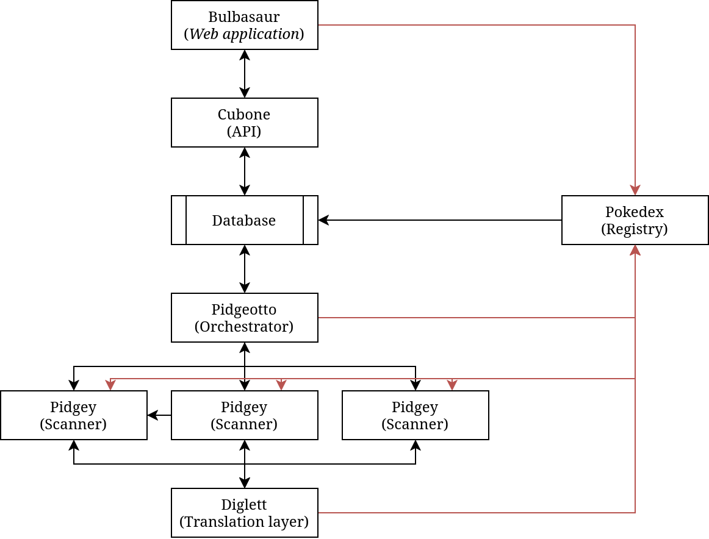

# Mapping the Internet
## Services
Here is the full list of services and what they do:

- Pokedex - The service list and authentication provider
- Pidgeotto - Manages the scanning process, utilising its pidgey instances
- Pidgey - Gathers information about an address
- Diglett - Translation layer for plaintext data to JSON
- Cubone - API used to access the collected data
- Bulbasaur - Web application for viewing the data

### Diagram


## Address
We want to know these things about a specific address:
- What is its allocation state (Unknown, Reserved, Unallocated, Allocated)
- Whether it is routed
- Whether it is online
- Which RIR this address originally falls under (/8 block segments)
- Which RIR does this address belong to
- Which ASN does this address belong to

Here is the address record structure from the database
```yml
- id: string
- allocation_state_id: bool
- top_rir_id: int
- rir_id: int
- asn_id: int
- country_id: int
- routed: bool
- online: bool
```

### Allocation states
An IPv4 address can be in one of the following allocation states:
- `unknown` - self explanatory
- `reserved` - the address is reserved
- `unassigned` - the address wasn't yet assigned to a register or the register has not yet given it away
- `assigned` - the address was assigned

## TODO
- [ ] (Diglett) implement automatic downloads of asn prefixes file with cron
- [ ] (Pidgey) Pidgeotto service discovery via Pokedex
- [ ] (Pidgeotto) Implement job queue and rework the scanning to progresivelly scan and add to queue
- [ ] (Pidgeotto) Implement stale address records via updated_at timestamps
- [ ] (Pidgey) Return the 500 error when Diglett responds with a 500 error
- [ ] (Pidgeotto) Implement a timeout when waiting for a job response from Pidgey
- [ ] (Diglett) Finish the transition to Settings
- [ ] (Pokedex) Update example config and .gitignore
- [ ] (Pidgeotto) Update example config and .gitignore
- [x] (Pidgey) Update example config and .gitignore
- [x] (Pidgey) Test Pidgeotto connect procedure
